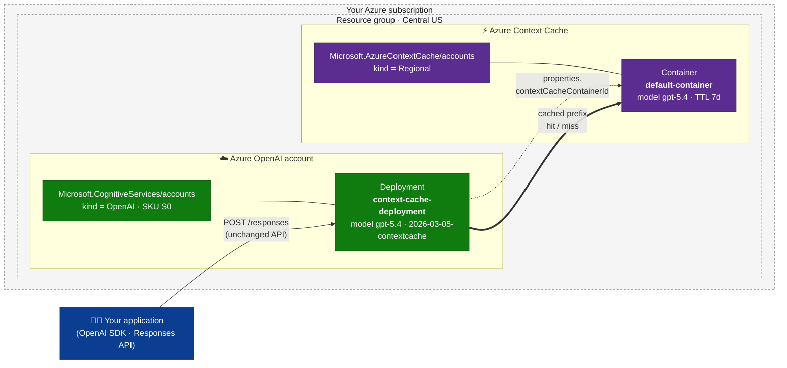

<div align="center">

# Azure Context Cache — Quickstart

**Turn on explicit prompt caching for your Azure OpenAI endpoints with a single click.**

[](https://portal.azure.com/#create/Microsoft.Template/uri/https%3A%2F%2Fraw.githubusercontent.com%2Fkraman-msft-eng%2FAzureContextCache%2Fmain%2Fazuredeploy.json)
[](https://armviz.io/#/?load=https%3A%2F%2Fraw.githubusercontent.com%2Fkraman-msft-eng%2FAzureContextCache%2Fmain%2Fazuredeploy.json)

*Launch region: **Central US** · Preview*

</div>

---

## What is explicit context caching?

Modern LLM applications resend the **same large prefix** on every call — a system prompt, a tool catalog, a multi-page document, a few-shot rubric, a long conversation history. The model re-tokenizes and re-attends to that prefix every single time. You pay full input-token price for content that never changes.

**Explicit context caching** lets you tell the service *"this prefix is stable — keep it warm."* The provider stores the tokenized, pre-attended representation of that prefix and, on subsequent requests that begin with the same content, reuses it. The result:

- **Lower latency** — the cached prefix skips re-tokenization and prefill.
- **Lower cost** — cached input tokens are billed at a steep discount.
- **Higher throughput** — freed compute means more concurrent requests at the same capacity.

Unlike implicit (best-effort) caching that some endpoints do opportunistically, **explicit** caching is *contractual*: you create a named cache container, you tell the deployment to use it, and your application controls the lifetime.

### How Azure delivers it

Azure exposes explicit caching through a dedicated resource provider — **`Microsoft.AzureContextCache`** — that lives **in your subscription, in your region, under your RBAC**. An Azure OpenAI deployment opts in by setting a single property, `properties.contextCacheContainerId`, on the deployment resource. Once linked, every chat/completion request sent to that deployment automatically benefits from the cache — no SDK changes, no extra headers.

| Concept | Azure resource |
|---|---|
| Cache **namespace** for an org/team | `Microsoft.AzureContextCache/accounts` |
| Cache **storage unit** for a specific model | `Microsoft.AzureContextCache/accounts/containers` |
| **AOAI deployment** that uses the cache | `Microsoft.CognitiveServices/accounts/deployments` with `properties.contextCacheContainerId` |

This quickstart packages all three (plus the AOAI account itself) into one ARM template so you can be sending cache-aware requests in about two minutes.

---

## Architecture



**Request path under the cover**

1. Your app calls the AOAI deployment endpoint exactly as it does today (Responses API).
2. The deployment, because `properties.contextCacheContainerId` is set, consults the linked Context Cache container for a matching prefix.
3. On a **hit**, the cached tokenized/pre-attended state is reused; only the suffix (your new turn) is processed end-to-end. You are billed for cached input tokens at the discounted rate.
4. On a **miss**, the deployment processes the full prompt normally and writes the prefix into the container for future requests, respecting the container's `timeToLive`.

The cache container lives in **your** subscription so you control isolation, region residency, TTL, and lifecycle — and you can swap models or rotate cache contents without touching the AOAI account.

---

## One-click deploy

[](https://portal.azure.com/#create/Microsoft.Template/uri/https%3A%2F%2Fraw.githubusercontent.com%2Fkraman-msft-eng%2FAzureContextCache%2Fmain%2Fazuredeploy.json)

The button opens the Azure Portal **Custom deployment** blade pre-loaded with [`azuredeploy.json`](azuredeploy.json). You only need to pick:

| Field | Notes |
|---|---|
| **Subscription** | Any subscription where the preview features below are registered. |
| **Resource group** | New or existing; the four resources will be created here. |
| **Region** | Defaults to **Central US** (the launch region). Also supported: `swedencentral`. |
| **Name prefix** | 3–12 lowercase letters/digits. Used to derive `<prefix>-aoai` and `<prefix>-cache`. A unique value is suggested for you. |

Click **Review + create → Create**. When it finishes, the deployment **Outputs** tab gives you the AOAI endpoint, deployment name, and the cache container resource id.

### Prerequisite (once per subscription)

The preview features below must be `Registered` before the deployment can succeed. You only need to do this **one time** per subscription:

```bash
az provider register --namespace Microsoft.AzureContextCache
az feature  register --namespace Microsoft.AzureContextCache --name EnablePreview
az feature  register --namespace Microsoft.CognitiveServices --name OpenAI.ContextCacheAllowed
```

Both features are **gated** — if a status stays `Pending` for more than a few minutes, email **azurecontextcacherp@microsoft.com** for approval. A convenience script is included:

```powershell
./scripts/register-providers.ps1 -SubscriptionId <your-sub-id>
```

---

## What gets created

| # | Resource | Type | Defaults |
|---|---|---|---|
| 1 | Azure OpenAI account | `Microsoft.CognitiveServices/accounts` | kind `OpenAI`, SKU `S0`, public access on |
| 2 | Context Cache account | `Microsoft.AzureContextCache/accounts` | `accountKind = Regional` |
| 3 | Cache container | `Microsoft.AzureContextCache/accounts/containers` | model `gpt-5.4`, provider `OpenAI`, `timeToLive = 7d` |
| 4 | AOAI deployment **linked to (3)** | `Microsoft.CognitiveServices/accounts/deployments` (api `2026-03-15-preview`) | `Standard` / capacity `100`, model `gpt-5.4` v `2026-03-05-contextcache`, `contextCacheContainerId` pre-wired |

All four are created in a single ARM deployment, in the same region, in the resource group you pick. No portal click-through, no follow-up CLI.

---

## Using the cached deployment from your app

Nothing changes in your client code. Point the Azure OpenAI **Responses API** at the deployment created above and the cache is consulted transparently — every request whose `input` begins with the same stable prefix gets a hit.

```python
from openai import AzureOpenAI

client = AzureOpenAI(
    azure_endpoint = "<azureOpenAIEndpoint from outputs>",
    api_key        = "<your AOAI key>",
    api_version    = "2026-03-15-preview",
)

LONG_STABLE_SYSTEM_PROMPT = """You are an expert support agent for Contoso Cloud...
<thousands of tokens of stable instructions, tool catalog, few-shot examples>"""

resp = client.responses.create(
    model        = "context-cache-deployment",   # the AOAI deployment name
    instructions = LONG_STABLE_SYSTEM_PROMPT,    # cached prefix — keep byte-identical across calls
    input = [
        {
            "role": "user",
            "content": [
                {"type": "input_text", "text": user_turn},  # the only part that varies
            ],
        },
    ],
)

print(resp.output_text)
print("cached input tokens:", resp.usage.input_tokens_details.cached_tokens)
```

Equivalent raw REST call:

```http
POST {azureOpenAIEndpoint}/openai/v1/responses?api-version=2026-03-15-preview
Authorization: Bearer <token>
Content-Type: application/json

{
  "model": "context-cache-deployment",
  "instructions": "<LONG_STABLE_SYSTEM_PROMPT>",
  "input": [
    { "role": "user", "content": [{ "type": "input_text", "text": "<user turn>" }] }
  ]
}
```

> **Tip:** put the stable content in `instructions` (or as the leading items of `input`) and the volatile per-turn content at the **end**. Caching matches on the request **prefix**, so any byte change near the front invalidates the hit. Watch `usage.input_tokens_details.cached_tokens` on the response to confirm you are getting hits — the longer and more stable the prefix, the larger the savings.

---

## Customization

| To change | Edit |
|---|---|
| Region | `location` parameter on the template (`centralus` \| `swedencentral`) |
| Model / version | `modelName`, `modelVersion` variables in [`azuredeploy.json`](azuredeploy.json) or [`bicep/main.bicep`](bicep/main.bicep) |
| TTL, SKU, capacity | Same variables block |
| Use an **existing** AOAI account instead of creating a new one | Delete the AOAI account resource and reference an existing one as the deployment's parent — see [`bicep/main.bicep`](bicep/main.bicep) for the pattern |

A pure CLI flow is also provided:

```powershell
./scripts/deploy.ps1 -ResourceGroup rg-cc-demo                     # ARM JSON
./scripts/deploy.ps1 -ResourceGroup rg-cc-demo -UseBicep           # Bicep
```

---

## Repository layout

```
.
├── azuredeploy.json              # Single all-in-one ARM template (Deploy-to-Azure target)
├── azuredeploy.parameters.json   # Example parameter file
├── bicep/
│   ├── main.bicep                # Bicep equivalent
│   └── main.bicepparam
├── prereqs/
│   ├── assign-reader-role.json   # Optional: Reader for CSRP at sub scope (advanced)
│   └── assign-reader-role.bicep
├── scripts/
│   ├── register-providers.ps1    # One-time feature registration
│   └── deploy.ps1                # Convenience CLI wrapper
└── .github/workflows/validate.yml
```

---

## Troubleshooting

| Symptom | Resolution |
|---|---|
| `FeatureNotRegistered` on deploy | Run the three `az feature register` commands above and wait until each reports `Registered`. Email azurecontextcacherp@microsoft.com if state stays `Pending`. |
| `LocationNotAvailableForResourceType` | Only `centralus` (launch) and `swedencentral` are supported today. |
| `InvalidResourceName` | `namePrefix` must be 3–12 lowercase letters/digits. |
| Cache appears not to be used (no latency / cost improvement) | Confirm your prefix is **byte-identical** across requests, longer than a few hundred tokens, and that traffic is hitting the deployment created by this template (not a sibling deployment without `contextCacheContainerId`). |
| Need to unlink the cache later | PUT the same deployment with `properties.contextCacheContainerId` omitted (keep `sku` and `model` identical). |

---

<div align="center">
<sub>Built for the Azure Context Cache preview · Feedback: <a href="mailto:azurecontextcacherp@microsoft.com">azurecontextcacherp@microsoft.com</a></sub>
</div>
